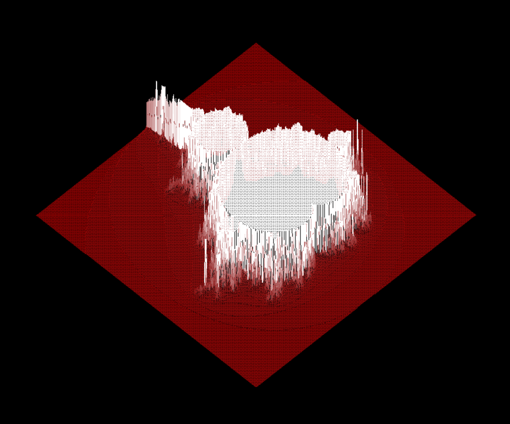
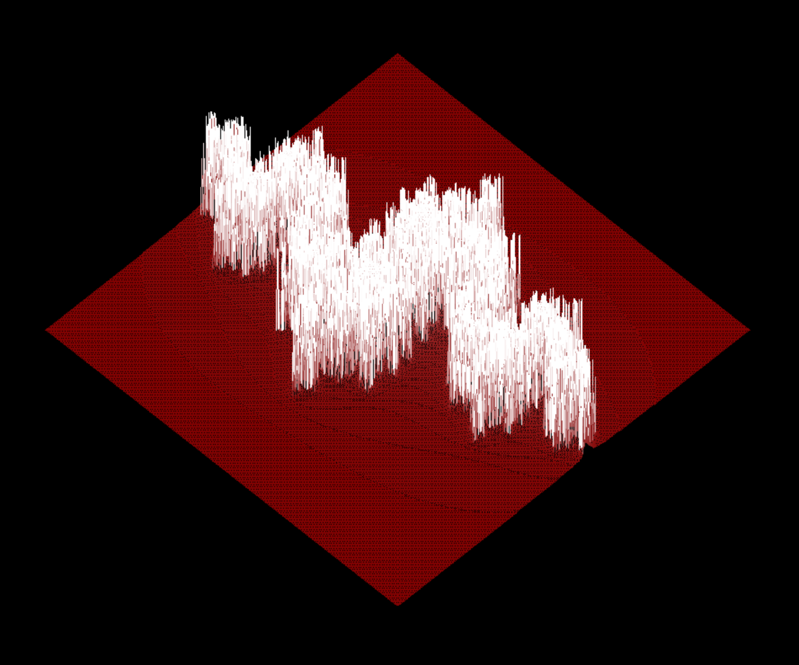

# fdf


## 🤓 Overview
Ever wanted to turn a text file filled with numbers into a 1980's style 3D rendering? I got you, fam.

## 🧐 So What's the Deal?
- **`Sample Maps`** : are available in the test_maps directory.

The first true "math-heavy" project, FdF takes a 2D set of elevation values and renders that map in an isometric display. As a bit of a kicker, you can add color values in hex, and it will interpret those too! Feel free to create your own maps to spell out curse words in **glorious 1980s style.**

(*curses not included)

### Fun things I learned:
- [Schlemeil the Painter](https://en.wikipedia.org/wiki/Joel_Spolsky#Schlemiel_the_Painter's_algorithm) is kinda a big deal. The original implementation would parse through several _billion_ steps. Not cool.
- Inverse trig functions are kinda hard to write yourself. Wanna ArcTan something? Pull out your abacus.

## 📷 Preview
Here is a visual representation of what the program does. These are the Mandlebrot and Julia sets. Each of them is roughly 50000 data points, and FdF handles it like a champ!




## 💻 Compilation
To compile:

```make```

Remove the object files:

```make clean```

Remove everything:

```make fclean```

## 🤡 Usage
```
$ ./fdf [some file]
```
There is one limitation: The map must be rectangular.

### 📝 License
Go nuts.
